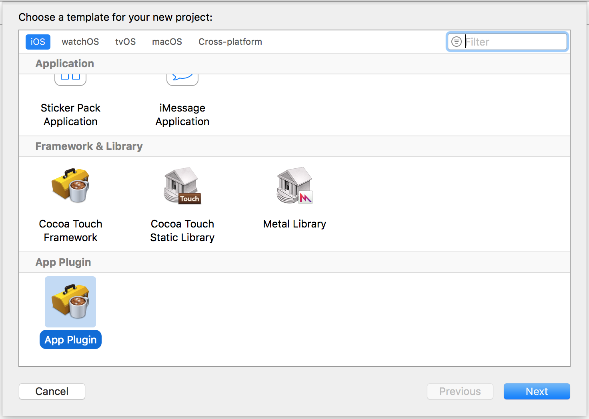
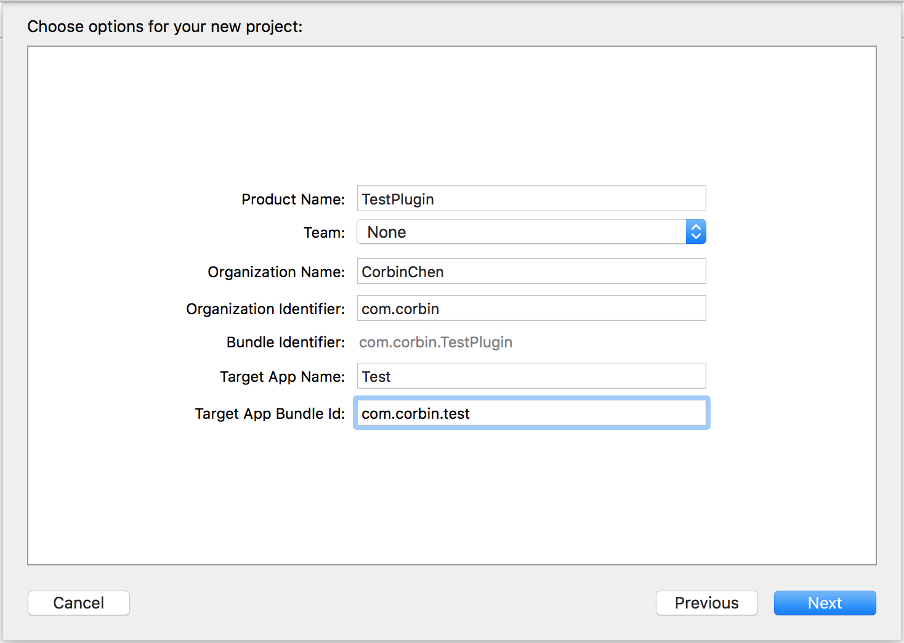
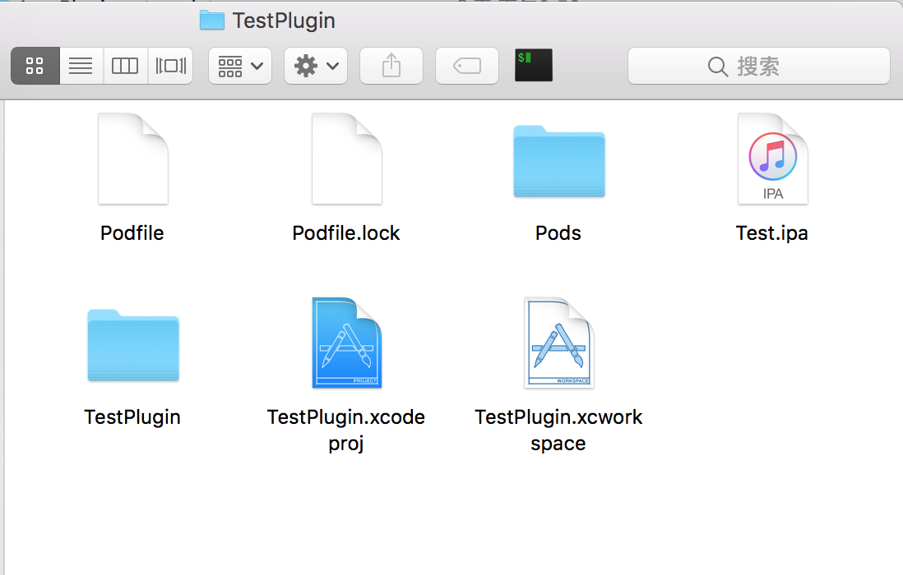
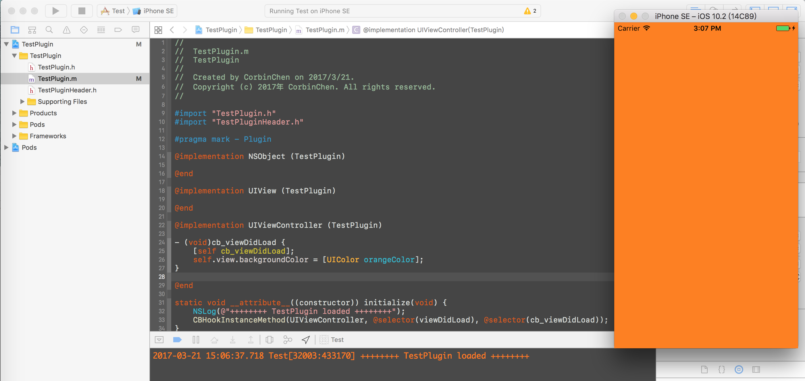
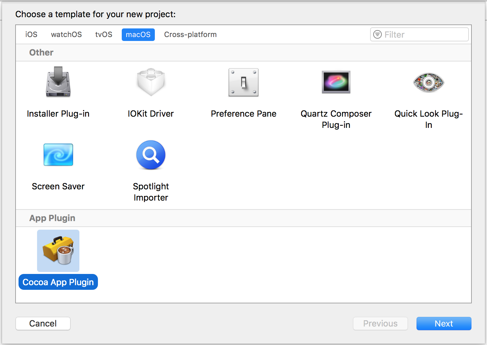
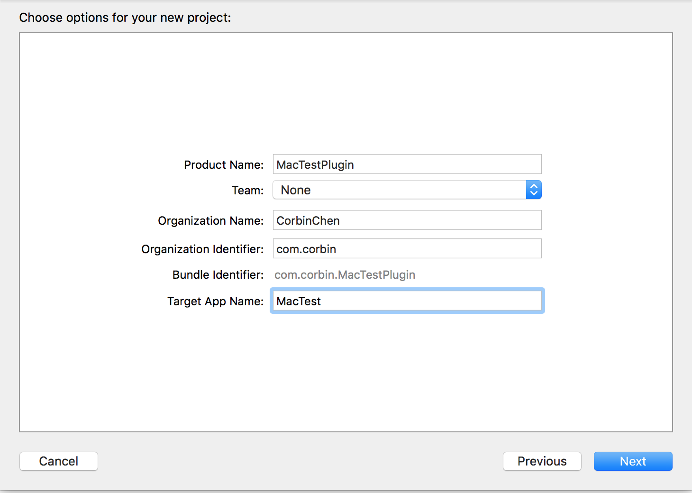
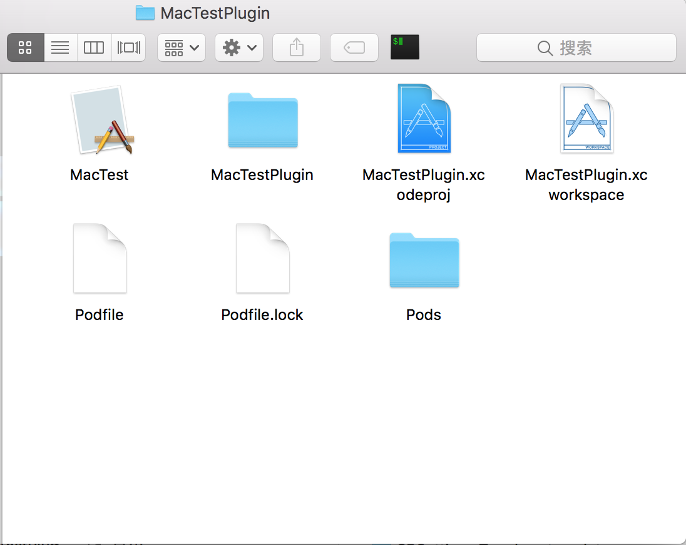
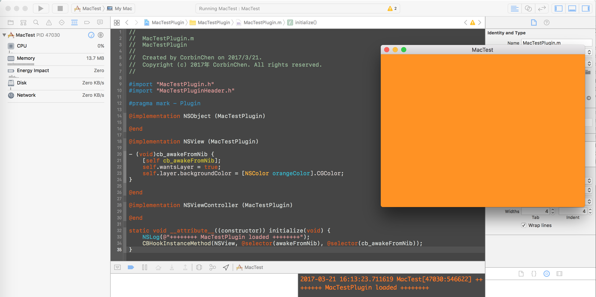

# XcodeAppPluginTemplate
App Plugin Project Template For iOS App and Mac App.

## Prerequisite
insert_dylib

## How to install

* Download or clone the repository  
* Copy `App Plugin` folder into `~/Library/Developer/Xcode/Templates/Project Templates`

## How to uninstall

Delete the following directory:`~/Library/Developer/Xcode/Templates/Project Templates/App Plugin`

## How to use - iOS

* Open Xcode and choose `App Plugin` under the iOS section.

* Write the project option to create project.   
(Hint: Target app name is the name of the ios app that you will provide to patch plugin. And Script will change the app bundle id to target app bundle id. )

* Copy the ipa file into project directory, run `pod install` in terminal.

  

## How to use - MacOS

* Open Xcode and choose `Mac App Plugin` under macOS section.

* Write the project option to create project.  
(Hint: Target app name is the name of the mac app that you will provide to patch plugin)

* Copy the mac app into project directory, run `pod install` in terminal.

